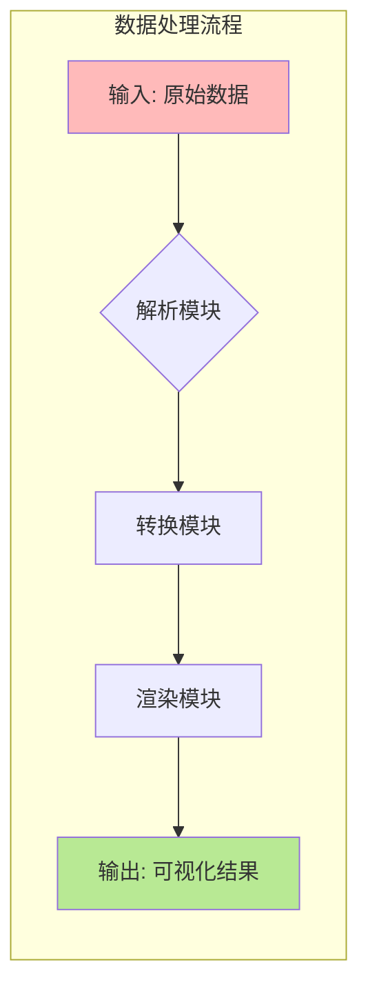
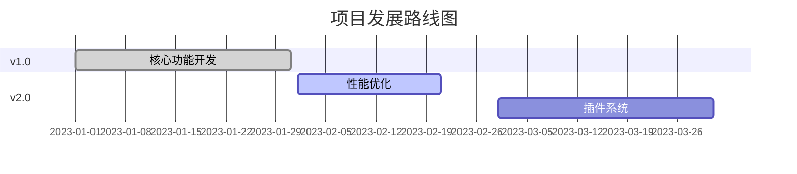

<!--
-------------------------------------------------------------------------------
  项目头部区域 (HEADER)
  这是用户第一眼看到的地方。一个精美的横幅或 Logo 能立刻提升专业感。
-------------------------------------------------------------------------------
-->
<p align="center">
  <!-- 建议尺寸: 1280x640px。可以使用 Canva, Figma 或 https://banners.beyondco.de/ 等工具制作 -->
  
</p>

<div align="center">

# [项目名称]

**[这里写项目的一句话核心价值定位，例如：“一个用于构建下一代Web应用的反应式框架”]**

---

<!--
  徽章区域 (BADGES)
  从 https://shields.io/ 生成。选择与你的品牌色一致的颜色。
  建议包含：构建状态, 版本, 许可证, 语言, 代码大小, 下载量, 社区链接等。
-->
<p>
  <a href="[构建状态链接]"></a>
  <a href="[发布页链接]"></a>
  <a href="LICENSE"></a>
  <a href="[语言链接]"></a>
  <a href="[代码大小链接]"></a>
  <a href="[下载量链接]"></a>
  <a href="[社区链接]"></a>
</p>

[🌐 在线体验](#-在线体验) •
[✨ 功能特性](#-功能特性) •
[🚀 快速开始](#-快速开始) •
[⚙️ API参考](#️-api参考) •
[🤝 参与贡献](#-参与贡献) •
[🗺️ 路线图](#️-路线图)

</div>

<!--
-------------------------------------------------------------------------------
  概览与核心视觉区域 (OVERVIEW & VISUALS)
  展示项目最直观的部分。
-------------------------------------------------------------------------------
-->

---

## 🖼️ 概览与演示

[这里简要描述你的项目解决了什么核心问题，然后用一张最吸引人的 GIF 或截图来展示最终效果。]

> **核心理念**: [用一句话概括你的项目设计哲学或解决了什么痛点]。

<p align="center">
  <!-- 建议使用 GIF，工具: ScreenToGif, GIPHY CAPTURE -->
  
</p>

---

## 🌐 在线体验

[如果你的项目是Web应用，这是最重要的部分。]

> ### 🚀 [点击这里，立即体验！]([你的Live-Demo链接])

---

<!--
-------------------------------------------------------------------------------
  主要内容区域 (MAIN CONTENT)
  详细介绍项目的方方面面。
-------------------------------------------------------------------------------
-->

## ✨ 功能特性

- **⚡️ 高性能**: [描述为何性能高，例如：使用 Rust 编写，内存安全且速度快。]
- **🔌 插件化架构**: [描述其扩展性，例如：支持自定义插件，易于扩展。]
- **🎨 主题定制**: [描述其可定制性，例如：内置多种主题，支持完全自定义 UI。]
- ** DX 友好**: [描述其开发者体验，例如：提供详细的文档和类型定义。]

---

## ⚙️ 架构与工作流程

[使用 Mermaid 图表清晰地展示项目的数据流、架构或工作原理。]



---

<details>
<summary>📈 性能基准 (可选)</summary>

[如果性能是项目的关键卖点，请在此处展示。]

与同类工具 `Tool X` 和 `Tool Y` 相比，本项目在处理 1GB 数据时表现如下：

| 任务 | 本项目 | Tool X | Tool Y |
|:---|:---:|:---:|:---|
| 数据解析 | **0.5s** | 2.1s | 1.8s |
| 内存占用 | **120MB** | 500MB | 450MB |

<!-- 也可以在这里放一张性能对比的图表图片 -->

</details>

---

## 🚀 快速开始

### 1. 环境依赖

- [Node.js](https://nodejs.org/) >= 18.0
- [Python](https://www.python.org/) >= 3.10
- [Docker](https://www.docker.com/) (可选)

### 2. 安装

<details>
<summary><b>(方式一) 使用包管理器 (推荐)</b></summary>

```bash
# NPM
npm install -g [包名]

# PIP
pip install [包名]
```
</details>

<details>
<summary><b>(方式二) 从源码构建</b></summary>

```bash
git clone https://github.com/[用户名]/[仓库名].git
cd [仓库名]
npm install
npm run build
```
</details>

<details>
<summary><b>(方式三) 使用 Docker</b></summary>

```bash
docker pull [用户名]/[镜像名]
docker run -it [用户名]/[镜像名]
```
</details>

### 3. 使用

[提供一个最简单的“Hello World”级别的代码示例。]

```bash
# 运行项目
[你的命令] --input data.csv --output result.json
```

---

<details>
<summary>⚙️ API 参考与高级配置 (可选)</summary>

#### 主要函数 / API 端点
- `GET /api/users`: 获取用户列表。
- `POST /api/users`: 创建一个新用户。

#### 配置文件 (`config.yaml`)
```yaml
# 端口号
port: 8080

# 数据库连接
database:
  host: localhost
  user: root
```

</details>

---

<details>
<summary>❓ 常见问题 (FAQ) (可选)</summary>

- **Q: 为什么启动时会报错？**
  - **A:** 请确保您的 Node.js 版本是 18 或更高。

- **Q: 如何贡献？**
  - **A:** 请参考我们的 [贡献指南](#-参与贡献)。

</details>

---

<!--
-------------------------------------------------------------------------------
  社区与治理区域 (COMMUNITY & GOVERNANCE)
  展示项目的健康度和发展方向。
-------------------------------------------------------------------------------
-->

## 🗺️ 路线图

[使用 Mermaid Gantt 图展示未来计划，表明项目在积极维护。]



---

## 🤝 参与贡献

我们热烈欢迎各种形式的贡献！如果您对本项目有任何想法或建议，请随时开启一个 [Issue](https://github.com/[用户名]/[仓库名]/issues) 或提交一个 [Pull Request](https://github.com/[用户名]/[仓库名]/pulls)。

在您开始之前，请花点时间阅读我们的 [**贡献指南 (CONTRIBUTING.md)**](CONTRIBUTING.md) 和 [**行为准则 (CODE_OF_CONDUCT.md)**](CODE_OF_CONDUCT.md)。

### ✨ 贡献者们

感谢所有为本项目做出贡献的开发者！

<a href="https://github.com/[用户名]/[仓库名]/graphs/contributors">
  
</a>

---

## 🛡️ 安全策略

我们非常重视项目的安全性。如果您发现了任何安全漏洞，请不要公开讨论，而是通过 [**我们的安全策略**](SECURITY.md) 中描述的途径与我们联系。

---

<!--
-------------------------------------------------------------------------------
  页脚区域 (FOOTER)
  最后的行动号召和感谢。
-------------------------------------------------------------------------------
-->

## 📜 许可证

本项目采用 [MIT](LICENSE) 许可证。

---

<div align="center">

**如果这个项目对您有帮助，请不要吝啬您的 Star ⭐！**

<!-- Star History: https://star-history.com/ -->
<a href="https://star-history.com/#[用户名]/[仓库名]&Date">
  
</a>

<br>

**Made with ❤️ and a lot of ☕ by [你的名字或团队名]**

[⬆ 回到顶部](#[项目名称])

</div>